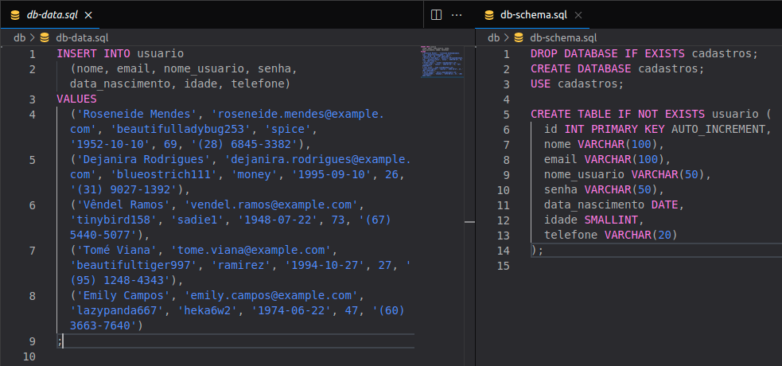

# Data Generator

Gere dados para você poder fazer consultas no seu banco de dados!

Script feito para gerar arquivos `.sqls` com dados para poder fazer consultas usando o `SELECT`, às vezes é chato gerar dados para poder fazer consultas, então esse script automatiza esse processo.


## Instalação

Você precisa ter o Python 3.9+, instale as dependências com `pip install -r requirements.txt` e execute o seguinte comando:

```bash
python3 generator.py quantity
```

> *quantity* é a quantidade de tuplas que serão geradas, o máximo é **5000** e se não for passado o padrão é **5000**.


## Exemplo

```bash
python3 generator.py 5
```

### Resultado



*Se divirta com as consultas!*
